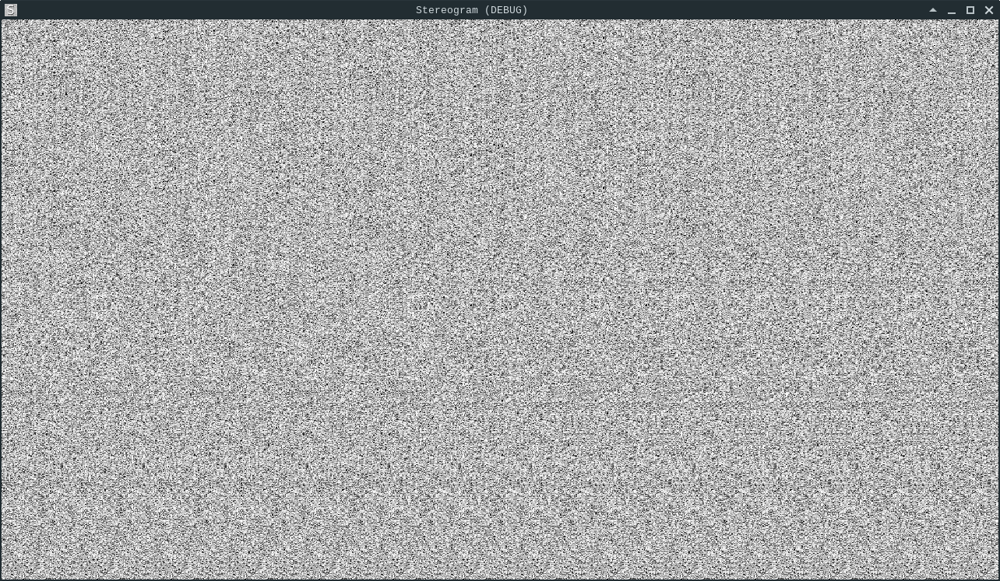
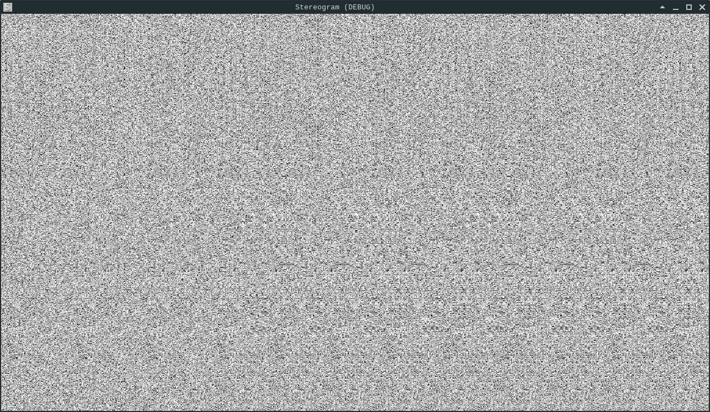

# Stereogram 3D platformer

Kinematic character demo 3D modified to render as auto random dot stereogram

Build with Godot v3.2.3 stable (it's quite hackish, just for fun)

Meshes from sketchfab by user "noe-3d.at"

# Downloads

You may clone or download this repository, binaries for Windows, Linux and HTML5 are in the "Bin" folder

# Screenshots

